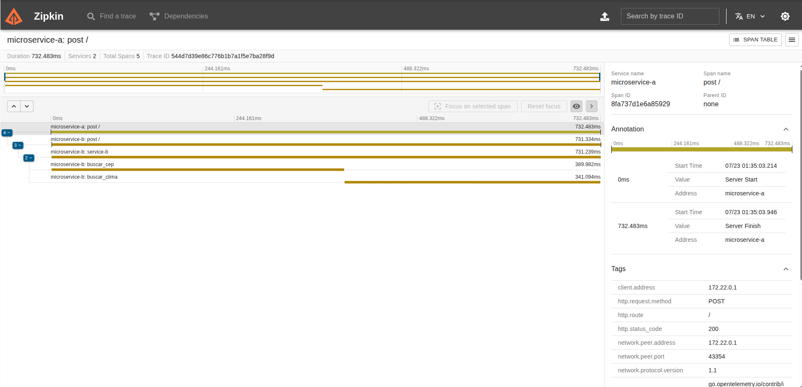
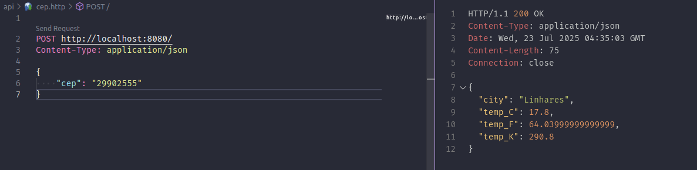

# Go Clima Tempo lab2

O objetivo é criar dois microserviços:

1. **Service A**: Recebe o CEP e valida entrada.
2. **Service B**: Recebe o CEP do serviço A e retorna a temperatura atual da cidade.


# Instruções para Execução

## Pré-requisitos

Gerar token de acesso para a API WeatherAPI e definir a variável de ambiente `WEATHER_API_KEY` com o valor do token.
https://www.weatherapi.com/

### Cópia do arquivo de variáveis de ambiente

Para configurar as variáveis de ambiente necessárias, copie o arquivo `.env.example` para `.env

```bash
cp .env.example .env
```

E edite o arquivo `.env` para incluir sua chave de API do WeatherAPI:

```bash
WEATHER_API_KEY="sua_chave_aqui"
```

### Docker compose build

Para executar o projeto, utilize o seguinte comando:

```bash
docker-compose up --build
# ou
docker compose up --build
```

Isso irá construir a imagem do Docker e iniciar o serviço da API na porta http://localhost:8080

# Verifique se o docker-compose está online

```bash
docker-compose ps
# ou
docker compose ps
```

## Testando a API

Utilize o arquivo cep.http dentro da pasta `api/` para testar a API.

ou

```bash
curl --request POST \
  --url http://localhost:8080/ \
  --header 'content-type: application/json' \
  --data '{"cep": "29902555"}'

```

ou

```bash
curl --request POST \
  --url http://localhost:8080/cep \
  --header 'content-type: application/json' \
  --data '{"cep": "29902555"}'
```

## portas

### Portas utilizadas pelos serviços

- **Service A**: Porta 8080
- **Service B**: Porta 8081
- **Zipkin**: Porta 9411

## screenshot




